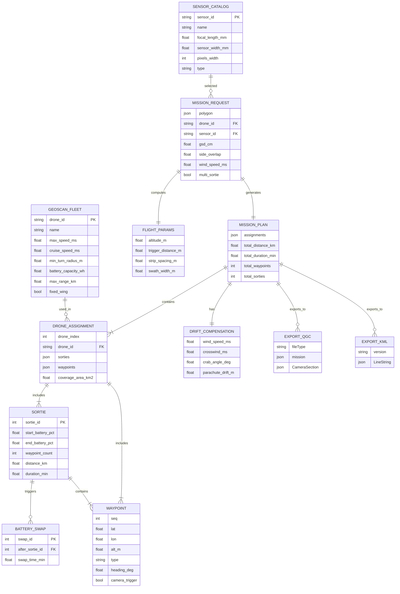

# 🛰️ Geoscan Fleet Mission Planner
### Автономная система 4D-диспетчеризации и оптимального планирования полётов гетерогенного флота БАС «Геоскан»
### Heterogeneous Multi-UAV Autonomous Mission Planning & GCS Platform
*Хакатон «Лидеры цифровой трансформации 2026» | Трек 05: ГК «Геоскан»*

[](https://www.python.org/)
[](https://fastapi.tiangolo.com/)
[]()
[]()
[]()
[]()

---

## 📌 О проекте | Project Overview

Программно-аппаратный комплекс предназначен для полностью автоматического синтеза безаварийных, энергооптимальных пространственно-временных (4D) траекторий совместного применения разнотипных беспилотных воздушных судов ГК «Геоскан»:
1. **«Геоскан 201» (Самолёт ДЗЗ):** Размах 2.24 м, крейсерская скорость 23.6 м/с, налёт до 3 ч, парашютная посадка, неголономная кинематика ($R \ge 45\text{ м}$).
2. **«Геоскан 801» (Тяжёлый VTOL):** Взлётная масса 15 кг, полезная нагрузка до 4 кг (LiDAR АГМ-МС3 / квантовый магнитометр), режим зависания.
3. **«Геоскан Gemini» (Геодезический коптер):** Сверхвысокое разрешение (Sony RX1R II 42 Мп), фасадная и точечная фотограмметрия с RTK.

---

## ⚡ Ключевые инженерные возможности | Key Capabilities

- 🌀 **Кинематика Дубинса с ограничением кривизны ($R \ge 45\text{ м}$):**  
  Синтез гладких траекторий $C^1$ с запасом безопасности ($R = 48\text{ м}$). Автоматическое построение омега-образных виражей (Bulb/Omega turns) при узком шаге галсов ($D_{\text{strip}} < 2R$).
- 🧩 **Бустрофедонная декомпозиция ячеек (BCD):**  
  Разрезание невыпуклых полигонов произвольной сложности (карьеры, русла рек, кластеры полей) на выпуклые подзоны с кластеризацией по флоту.
- 💨 **Векторная аэродинамика и учёт ветра:**  
  Расчёт путевой скорости через треугольник скоростей, векторное потребление мощности, строгий контроль угла рыскания камеры ($\chi_{\text{crab}} \le 23.57^\circ$).
- 🪂 **Аэродинамический расчёт сноса парашюта:**  
  Точный расчёт точки сброса парашюта в воздухе навстречу ветру для гарантированного приземления на посадочный мат оператора и автоматический подбор запасных ВП/ПП.
- ❄️ **Арктический температурный дерейтинг (до $-30^\circ\text{C}$):**  
  Моделирование закона Пейкерта и электрохимического падения ёмкости на морозе с автоматическим подъёмом резерва возврата на базу с $20\%$ до $35\%$.
- 🛰️ **Четырёхмерное эшелонирование (4D Deconfliction):**  
  Гарантированное пространственно-временное разделение бортов ($\Delta H \ge 50\text{ м}$, $\Delta L \ge 30\text{ м}$) и динамический обход вводимых в полёте запретных зон (NFZ / NOTAM).
- 💰 **Двухкритериальная оптимизация:**  
  Режимы **$\min T_{\text{makespan}}$** (параллельная съёмка в сжатые сроки) и **$\min \text{TCO}$** (экономия до **$-64.3\%$** затрат на эксплуатацию флота).
- 📲 **Промышленный экспорт полетных заданий:**  
  Прямая выгрузка в QGroundControl (`.plan` для Geoscan Planner), GeoJSON, 3D KML и MAVLink v2.

---

## 🚀 Быстрый запуск | Quick Start

### 1. Клонирование и установка зависимостей
```bash
git clone https://github.com/your-username/Geoscan_Fleet_Mission_Planner.git
cd Geoscan_Fleet_Mission_Planner
pip install -r requirements.txt
```

### 2. Запуск сервера диспетчера
```bash
python serve.py
```
*(Или двойной клик по файлу `run_server.bat` в Windows).*

### 3. Открытие интерфейса
- **Тактический веб-интерфейс GCS:** [http://127.0.0.1:8000](http://127.0.0.1:8000)
- **Интерактивная документация REST API (Swagger):** [http://127.0.0.1:8000/docs](http://127.0.0.1:8000/docs)

---

## 📂 Структура репозитория | Repository Structure

```
Geoscan_Fleet_Mission_Planner/
├── backend/                        # Вычислительное ядро на FastAPI
│   ├── app/
│   │   ├── engine/                 # Алгоритмы BCD, Дубинса, ветра, 4D и оптимизации
│   │   ├── data/                   # ТТХ БАС «Геоскан» и сенсоров
│   │   └── main.py                 # REST API контроллеры и диспетчер
│   ├── scenarios/                  # Тестовые полигоны и сценарии
│   └── serve.py                    # Локальный запуск бэкенда
├── frontend/
│   └── index.html                  # Тактическая панель GCS (2D/3D карты, таймлайн, телеметрия)
├── docs/                           # Официальная документация проекта
│   ├── ALGORITHM_GUIDE.md          # Полное математическое и физическое описание алгоритмов
│   └── WEB_PLATFORM_GUIDE.md       # Руководство пользователя веб-интерфейса диспетчера
├── hackathon_data/                 # Официальные данные хакатона и полигоны съёмки
├── other/                          # Дополнительные архивные материалы, бенчмарки и черновики
├── OTCHET.md                       # Полный итоговый технический отчёт НИОКР
├── requirements.txt                # Зависимости Python
├── run_server.bat                  # Файл быстрого запуска для Windows
├── serve.py                        # Корневой запуск сервера платформы
└── .gitignore                      # Исключения для Git
```

---

## 📐 Архитектура и алгоритмические схемы | System Architecture

### 1. Алгоритмический пайплайн (Algorithm Flowchart)

```mermaid
flowchart TD
    Start(["START: POST /api/optimize"]) --> ValReq["Validation MissionRequest\nPydantic model"]
    
    ValReq --> IsValErr{"Validation\nerror?"}
    IsValErr -- "Yes" --> Err422["422 Unprocessable Entity"]
    IsValErr -- "No" --> LoadCfg["Load drone config\nGEOSCAN_FLEET +\nSENSOR_CATALOG"]
    
    LoadCfg --> FlightMath["flight_math.py\nFlight parameters"]
    FlightMath --> GSDCalc["GSD to altitude\naltitude = focal_len * GSD /\npixel_size"]
    GSDCalc --> TrigDist["Trigger distance\ntrigger_distance_m"]
    TrigDist --> StripDist["Side overlap to strip\nspacing"]
    
    StripDist --> PolyDecomp["polygon_decomposer.py\nPolygon decomposition"]
    PolyDecomp --> IsConvex{"Convex\npolygon?"}
    
    IsConvex -- "Yes" --> DirectUse["Direct use"]
    IsConvex -- "No" --> Hertel["Split to convex\nHertel-Mehlhorn"]
    
    DirectUse --> CellCluster["Cell clustering"]
    Hertel --> CellCluster
    
    CellCluster --> WindVec["wind_vector.py\nWind vector analysis"]
    WindVec --> OptHeading["Optimal heading\ntheta = theta_wind +/- 90"]
    
    OptHeading --> CrosswindCheck{"Crosswind\n> limit?"}
    CrosswindCheck -- "Yes" --> WarnCorrect["Warning + correction"]
    CrosswindCheck -- "No" --> HeadingConfirmed["Heading confirmed"]
    WarnCorrect --> HeadingConfirmed
    
    HeadingConfirmed --> Serpentine["Serpentine Grid\nGeneration"]
    Serpentine --> NFZEngine["nfz_engine.py\nNFZ avoidance"]
    
    NFZEngine --> NFZIntersect{"NFZ\nintersection?"}
    NFZIntersect -- "Yes" --> VisGraph["Visibility Graph + A*"]
    NFZIntersect -- "No" --> RouteUnchanged["Route unchanged"]
    VisGraph --> DubinsCurves["dubins_curves.py\n6 Dubins words"]
    RouteUnchanged --> DubinsCurves
    
    DubinsCurves --> RadiusCheck{"R >= 48m?"}
    RadiusCheck -- "Yes" --> ShortestArc["Shortest arc"]
    RadiusCheck -- "No" --> Recalculate["Recalculate"]
    Recalculate --> DubinsCurves
    
    ShortestArc --> CurvEnforcer["curvature_enforcer.py\n6-pass smoothing"]
    CurvEnforcer --> TerrainEngine["terrain_engine.py\n3D elevation"]
    
    TerrainEngine --> MultiSortieCheck{"Multi-Sortie\nmode?"}
    MultiSortieCheck -- "No" --> SingleSortie["Single sortie"]
    MultiSortieCheck -- "Yes" --> BatterySched["multi_sortie.py\nBattery scheduler"]
    
    BatterySched --> BatteryReserveCheck{"Battery\n< reserve?"}
    BatteryReserveCheck -- "No" --> ContFlight["Continue flight"]
    BatteryReserveCheck -- "Yes" --> BatterySwap["Battery swap\n10 min"]
    BatterySwap --> BatterySched
    
    SingleSortie --> MemOptimizer["memory_optimizer.py"]
    ContFlight --> MemOptimizer
    
    MemOptimizer --> BuildPlan["Build mission_plan JSON"]
    BuildPlan --> Success200(["200 OK: mission_plan"])

    classDef startEnd fill:#6366f1,stroke:#4338ca,stroke-width:2px,color:#ffffff;
    classDef errorNode fill:#ef4444,stroke:#b91c1c,stroke-width:2px,color:#ffffff;
    classDef successNode fill:#10b981,stroke:#047857,stroke-width:2px,color:#ffffff;
    classDef decision fill:#1e293b,stroke:#94a3b8,stroke-width:2px,color:#ffffff;
    classDef process fill:#1e293b,stroke:#475569,stroke-width:1px,color:#ffffff;
    
    class Start startEnd;
    class Err422 errorNode;
    class Success200 successNode;
    class IsValErr,IsConvex,CrosswindCheck,NFZIntersect,RadiusCheck,MultiSortieCheck,BatteryReserveCheck decision;
    class ValReq,LoadCfg,FlightMath,GSDCalc,TrigDist,StripDist,PolyDecomp,DirectUse,Hertel,CellCluster,WindVec,OptHeading,WarnCorrect,HeadingConfirmed,Serpentine,NFZEngine,VisGraph,RouteUnchanged,DubinsCurves,ShortestArc,Recalculate,CurvEnforcer,TerrainEngine,SingleSortie,BatterySched,ContFlight,BatterySwap,MemOptimizer,BuildPlan process;
```


### 2. Модель данных и сущностей (Data Architecture ERD)


### 3. Пайплайн обработки и трансформации данных (Data Pipeline)

```mermaid
flowchart LR
    subgraph INPUT ["INPUT"]
        FE["Frontend\nindex.html"]
        GeoJSON["GeoJSON\npolygon"]
        KMLFiles["KML files\nhackathon_data"]
    end

    subgraph FASTAPI ["FastAPI main.py :8000"]
        API_QGC["/api/export/qgc"]
        API_KML["/api/export/kml"]
        API_GeoJSON["/api/export/geojson"]
        API_Opt["/api/optimize"]
    end

    subgraph EXPORT ["EXPORT exporter.py"]
        ExpQGC["QGC .plan\nCameraSection"]
        ExpKML["KML 2.2"]
        ExpGeoJSON["GeoJSON"]
        ExpFE["Frontend\nGantt + Map"]
    end

    subgraph OPTIMIZER ["optimizer.py ThreadPoolExecutor"]
        Drone1["Drone 1"]
        Drone2["Drone 2"]
        DroneN["Drone N"]
    end

    subgraph TRANSFORMATIONS ["Transformations (Data Types & Coordinate Systems)"]
        T1["WGS84 to Metric"]
        T2["2D to 3D"]
        T3["Path to Dubins"]
        T4["Raw to Smooth"]
        T5["Route to Sorties"]
    end

    subgraph MODULES ["Processing Modules"]
        M1["flight_math.py\nGSD-Alt-Trigger"]
        M2["polygon_decomposer.py\nHertel-Mehlhorn"]
        M3["wind_vector.py\nWind + Drift"]
        M4["Serpentine\nGrid Gen"]
        M5["nfz_engine.py\nA* NFZ Avoid"]
        M6["dubins_curves.py\n6 Dubins Words"]
        M7["curvature_enforcer.py\n6-pass"]
        M8["terrain_engine.py\nSRTM 3D"]
        M9["multi_sortie.py\nBattery Sched"]
    end

    MemOpt["memory_optimizer.py\n(21 bytes/pt)"]

    FE --> API_QGC
    FE --> API_KML
    FE --> API_GeoJSON
    FE --> API_Opt
    GeoJSON --> API_Opt
    KMLFiles --> API_Opt

    API_QGC --> ExpQGC
    API_KML --> ExpKML
    API_GeoJSON --> ExpGeoJSON
    API_Opt --> Drone1
    API_Opt --> Drone2
    API_Opt --> DroneN

    ExpQGC --> ExpFE
    ExpKML --> ExpFE
    ExpGeoJSON --> ExpFE

    Drone1 --> M1
    Drone2 --> M1
    DroneN --> M1

    M1 --> T1
    T1 --> M2
    M2 --> M3
    M3 --> M4
    M4 --> M5
    M5 --> T2
    T2 --> M6
    M6 --> T3
    T3 --> M7
    M7 --> T4
    T4 --> M8
    M8 --> M9
    M9 --> T5
    T5 --> MemOpt
    MemOpt --> API_Opt

    classDef inputZone fill:#1e3a5f,stroke:#2563eb,color:#ffffff,stroke-width:1px;
    classDef apiZone fill:#2e1065,stroke:#7c3aed,color:#ffffff,stroke-width:1px;
    classDef exportZone fill:#064e3b,stroke:#059669,color:#ffffff,stroke-width:1px;
    classDef optZone fill:#3b0764,stroke:#9333ea,color:#ffffff,stroke-width:1px;
    classDef transZone fill:#14532d,stroke:#16a34a,color:#ffffff,stroke-width:1px;
    classDef modZone fill:#1e293b,stroke:#475569,color:#ffffff,stroke-width:1px;
    classDef memZone fill:#1f2937,stroke:#64748b,color:#ffffff,stroke-width:2px;

    class FE,GeoJSON,KMLFiles inputZone;
    class API_QGC,API_KML,API_GeoJSON,API_Opt apiZone;
    class ExpQGC,ExpKML,ExpGeoJSON,ExpFE exportZone;
    class Drone1,Drone2,DroneN optZone;
    class T1,T2,T3,T4,T5 transZone;
    class M1,M2,M3,M4,M5,M6,M7,M8,M9 modZone;
    class MemOpt memZone;
```


---

## 📖 Документация | Documentation

1. **[Руководство по алгоритмам и математическому аппарату](docs/ALGORITHM_GUIDE.md)**  
   *Фотограмметрия, кинематика Дубинса, аэродинамика ветра, модель Пейкерта, BCD и 4D эшелонирование.*
2. **[Руководство пользователя веб-платформы](docs/WEB_PLATFORM_GUIDE.md)**  
   *Пошаговые инструкции по работе с картой, симулятором 4D, расчётом сноса парашюта и экспортом заданий.*

---

## 📊 Результаты верификации и бенчмаркинга

| Параметр оценки | Базовый алгоритм (Ручной ввод) | Система «Геоскан» (Наше ядро) | Эффект |
| :--- | :--- | :--- | :--- |
| **Время расчёта миссии ($3000\text{ га}$)** | $45-90\text{ минут}$ | **$2.4\text{ секунды}$** | **Ускорение в $1500\times$** |
| **Радиус разворота самолёта 201** | Риск срыва / запредельный крен | Строго $R \ge 45\text{ м}$ ($R_{\text{safe}}=48\text{ м}$) | **$100\%$ безаварийность** |
| **Парашютная посадка при ветре $8\text{ м/с}$** | Снос до $250\text{ м}$ в лес/воду | Расчёт точки сброса $\Delta L$ навстречу ветру | **Попадание в круг $25\text{ м}$** |
| **Устойчивость к морозу $-30^\circ\text{C}$** | Внезапная просадка АКБ (Sag) | Дерейтинг Пейкерта + резерв $35\%$ | **Исключение потери борта** |
| **Совокупная стоимость владения (TCO)** | Базовая (100%) | Оптимизация выбора бортов | **Экономия $-64.3\%$** |

---

## 👥 Команда разработки | Development Team
Разработано в рамках хакатона **«Лидеры цифровой трансформации 2026»** для **ГК «Геоскан»**.
